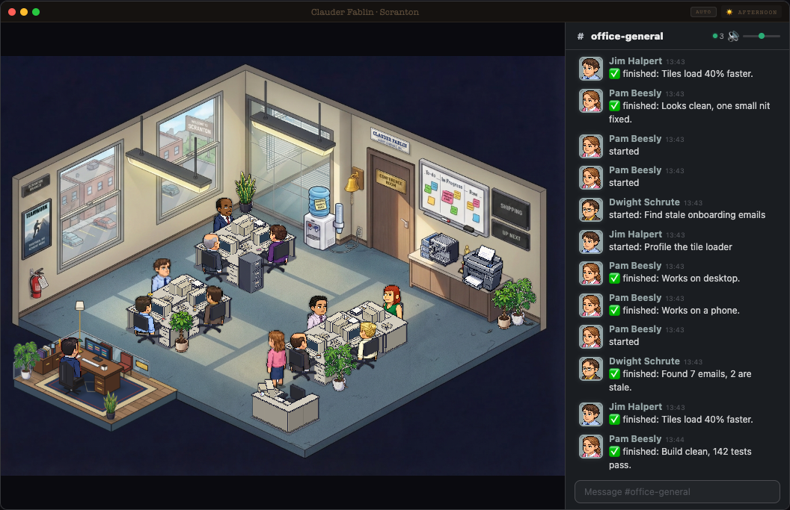

# Claude Office

A pixel-art office for Claude Code. Each Claude Code session gets a person at a desk. While it works, they type. When it needs you, they line up at the boss's door.



It adds to the Claude Code you already have. Works with any Claude Code model.

## Set it up

**Give Claude Code this link and say: set this up.**

**https://github.com/Obadaboom/claude-office**

Or paste this:

```
Set up the Claude Office from https://github.com/Obadaboom/claude-office. Clone it to ~/claude-office and follow its INSTALL.md. Show me any change to my Claude Code settings before you make it. Then start it and open it in my browser.
```

Claude follows [INSTALL.md](INSTALL.md). It asks you before it touches your settings.

## What you need

Claude Code. Claude checks and installs the rest (it asks first).

Works on Mac and Linux. On Windows, use WSL.

## What you'll see

- **The demo first.** A second office at http://localhost:3335 with made-up work. Type a task in the chat, like "Add a dark mode toggle". A pretend session builds it, gets reviewed, and waits for you at the door.
  - Tapping an option on a note works in demo mode only. We left the real version out on purpose: the session would have to wait for your tap, and while it waits you can't type to it in the Claude app.
- **Then your real office** at http://localhost:3333. Start a new Claude Code session. A person at a desk starts working.
- Click people, the coffee, the bell. Type `/the-office` in the chat to switch the theme.

## Your own boards

Five things in the office open boards: the board on the wall (To-do), the TV (Shipping), the boss's desk (Decisions), the poster (Marketing) and the filing cabinet (Older).

They read plain markdown in `~/.agent-office/boards`. The first start puts three sample projects there. Your edits are never overwritten. The easy way to fill them: ask Claude, "add a task to my office board".

The file shapes:

- `PROJECTS.md` lists projects in a table. The first cell links to the project's STATUS.md. Project folder names use lowercase letters, digits and dashes.

  ```
  | Project | Status |
  |---|---|
  | [Harbor Coffee app](projects/harbor-coffee/STATUS.md) | active |
  ```

- Each project has `projects/<name>/STATUS.md` with a task table `| # | Task | Owner | Status |`. Status `queued` or `building` = to do. `built` or `ready` = needs you. `done`, `live` or `shipped` = off the board.
- `LOG.md`: one line per event, `- 2026-10-01 09:40 — Nimbus Notes: dark mode LIVE`. LIVE, SHIPPED, DONE or merged puts it on the Shipping board.
- `DECISIONS.md`: open questions, `- [ ] 2026-10-01 — **Pick the launch day** Friday or Monday.` Put an indented `  - In short: Pick Friday or Monday for the launch.` line under one, and the desk shows that line when you open it.
- `MARKETING.md`: a `## Marketing now` table `| # | Item | Now |`. Now starts with needs, running, posted or stopped.

Every table needs its header row and a `|---|` line right under it, like the PROJECTS.md example.

Anything older than 7 days moves to the filing cabinet.

Plain sentences are optional and off by default. Turn them on and Claude Haiku writes one short everyday sentence for each item, shown when you open it. It uses a little of your Claude plan: each line goes to Claude once, then the sentence is kept in `~/.agent-office/plain-cache.json`. To turn them on, start the office with `AGENT_OFFICE_PLAIN=1 npm run dev:all`. The demo office never uses them.

## Privacy

- Everything stays on your computer. The office only listens on 127.0.0.1.
- The hook sends small events to it. Only these:
  - the event name and the session id
  - the paths of the session's transcript files
  - the name of a skill or MCP tool
  - a file's name, never its path or its contents (like "reading App.tsx")
  - a search pattern, up to 40 characters
  - a command's description, up to 60 characters, never the command
  - a subagent's type, its description up to 80 characters, and the first line of its answer up to 100 characters
- It never sends your prompts.
- The office reads your Claude Code session files on your computer to show titles and notes.
- Plain sentences are off by default. If you turn them on, your board lines go to Claude through your own `claude` command.

## How to remove it

1. Stop the office (Ctrl+C where it runs).
2. Take the hooks out of `~/.claude/settings.json`: delete the entries whose command ends in `agent-tracker.sh`. Or restore the backup the installer made next to it (`settings.json.backup.<time>`). Or ask Claude to do it.
3. Delete `~/claude-office` and `~/.agent-office`.

## Credit

Built on [Claude-Office](https://github.com/W17ant/Claude-Office) by W17ANT, MIT license. The Dunder Mifflin theme and the cast come from there.

## By hand

If you would rather not use Claude:

```bash
git clone https://github.com/Obadaboom/claude-office ~/claude-office
cd ~/claude-office
npm ci
npm run install-hooks      # adds the hook to ~/.claude/settings.json (makes a backup first)
npm run demo               # demo: open http://localhost:3335/?theme=office
npm run dev:all            # real office: open http://localhost:3333/?theme=office
```
